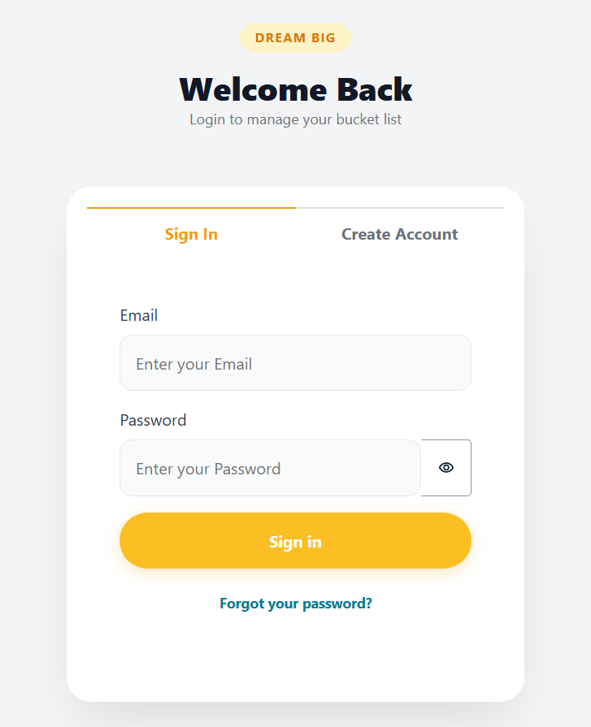

# 🚀 Serverless Bucket List Tracker

A full-stack serverless application built with **AWS Amplify Gen 2**, **React (Vite)**, and **TypeScript**. This application allows users to securely manage their life goals (bucket list), utilizing per-user data isolation and cloud storage for image assets.



## ✨ Key Features

* **Secure Authentication:** Sign-up, Sign-in, and MFA flows handled by **Amazon Cognito**.
* **Real-time Data:** Instant CRUD operations using **Amazon DynamoDB**.
* **Image Uploads:** Users can upload photos for their bucket list items (stored in **Amazon S3**).
* **Data Privacy:** Implemented **Per-User Authorization**, ensuring users can only access their own data.
* **Responsive UI:** Optimized for both desktop and mobile devices.

---

## 🔄 Application Flow

This project leverages the **AWS Code-First** approach. Here is how the system works:

1.  **Frontend:** The user interacts with the React UI (hosted on Amplify).
2.  **Auth:** When a user logs in, the request is authenticated by **Amazon Cognito**.
3.  **API:** Validated requests are sent to **AWS AppSync** (GraphQL API).
4.  **Data:** Text data (Title, Description) is stored in **DynamoDB**.
5.  **Storage:** Image files are uploaded directly to a secure **S3 Bucket**.

---

## 🛠️ Getting Started Locally

Follow these steps to run the application on your local machine.

### Prerequisites
* Node.js (v18+ recommended)
* NPM
* AWS Account & Credentials configured locally

### Installation

1.  **Clone the repository**
    ```bash
    git clone https://github.com/Auriga77/bucketlistapp.git
    cd bucketlistapp
    ```

2.  **Install Dependencies**
    ```bash
    npm install
    ```

3.  **Start the Cloud Sandbox**
    This command deploys a personal cloud sandbox for backend development.
    ```bash
    npx ampx sandbox
    ```
    *(Wait until the `amplify_outputs.json` is generated)*

4.  **Run the Frontend**
    Open a new terminal window:
    ```bash
    npm run dev
    ```

5.  **Open in Browser**
    Visit `http://localhost:5173` to view the app.

---

## 🚀 Live Demo

Check out the live deployment here: **[Live App Link](https://main.d3ih5bjyl8xer9.amplifyapp.com/)** only for testing purpose "one week trial".